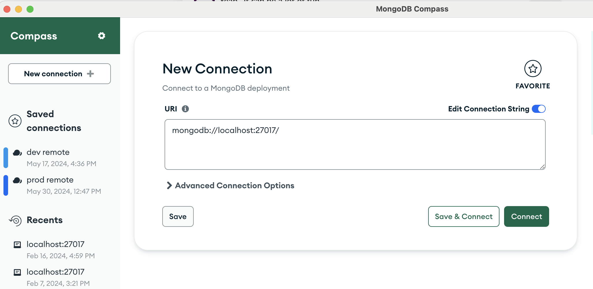
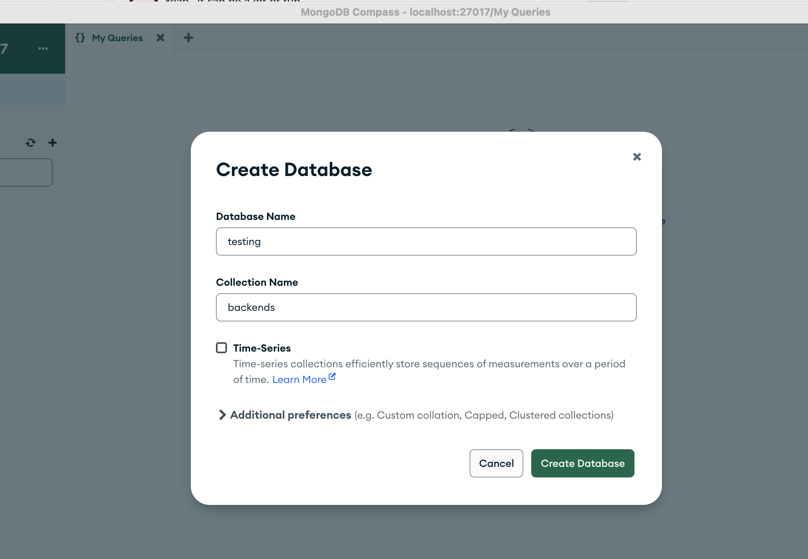
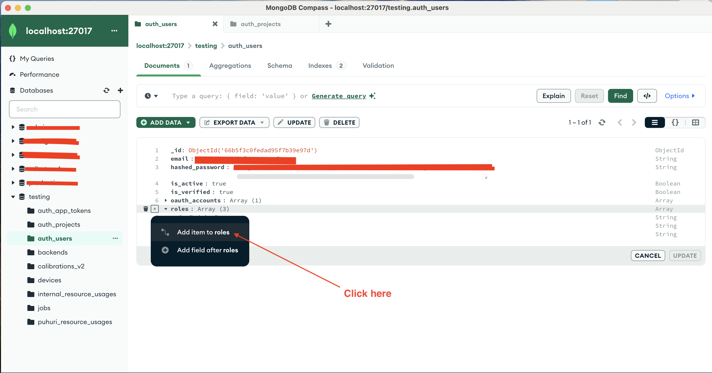
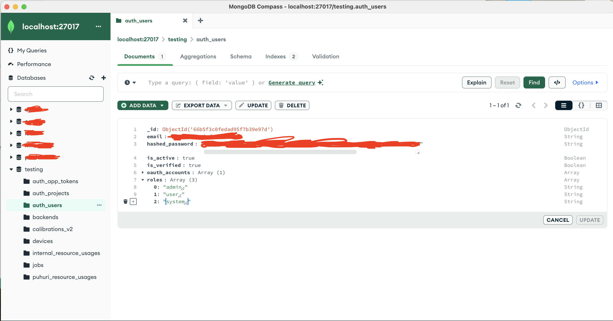
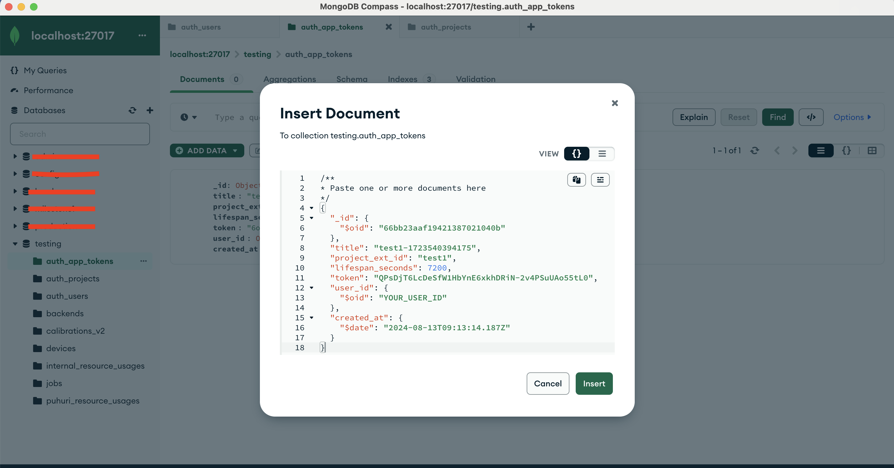
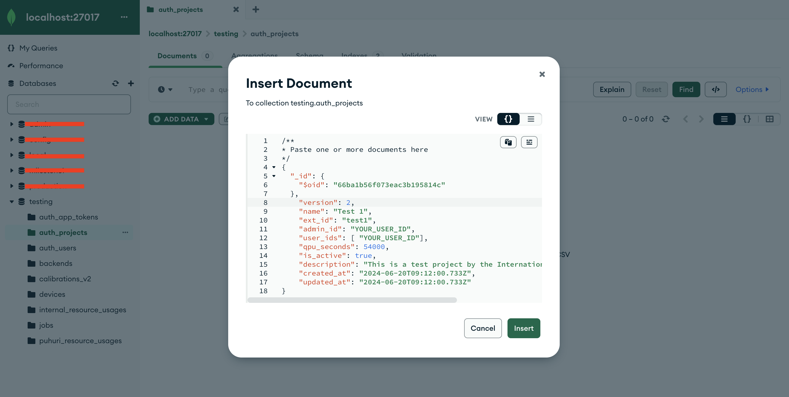
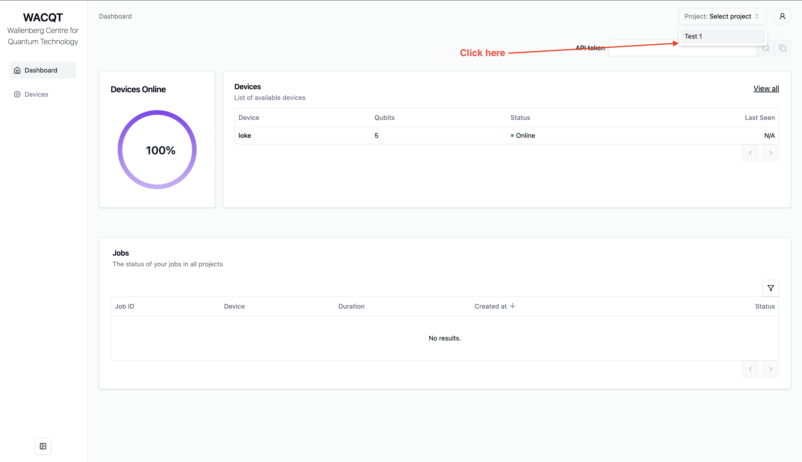
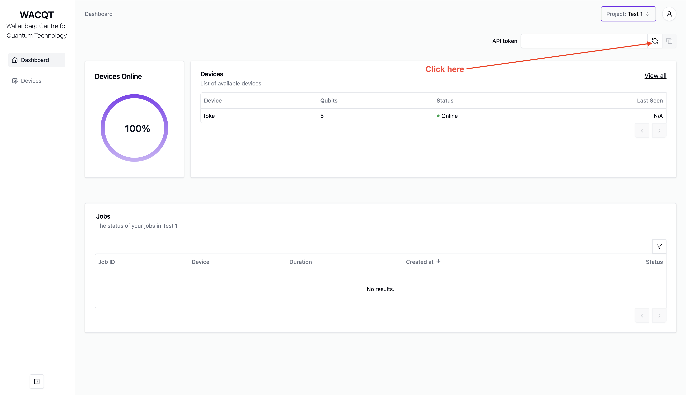

Let's attempt to setup the Tergite stack to run on a dummy cluster on your local
machine.

We will not need an actual quantum computer.
Take note, however, that the dummy cluster only returns 0 in its results.

## Prerequisites

You may have to install these software if you don't have them already installed.

- [Docker +v23.0.5](https://www.docker.com/products/docker-desktop/)
- [Conda](https://docs.anaconda.com/free/miniconda/index.html)
- [Redis](https://redis.io/docs/latest/operate/oss_and_stack/install/install-redis/)
- [MongoDb](https://www.mongodb.com/docs/manual/administration/install-community/)
- [Visual Studio Code](https://code.visualstudio.com/download)
- [Mongo compass](https://www.mongodb.com/docs/compass/current/install/)

## Setup the Frontend

- Ensure you have [docker](https://docs.docker.com/engine/install/) is running.

```zsh
docker --help
```

Note: for MacOS, start docker by running this command 

```zsh
open -a Docker
```

Note: for Windows, start docker by running this command 

```zsh
Start-Process "C:\Program Files\Docker\Docker\Docker Desktop.exe"
```

Note: for Linux, start docker by running this command 

```zsh
sudo systemctl start docker
```

- Open another terminal

- Clone the [tergite-frontend](https://github.com/tergite/tergite-frontend) repo

```zsh
git clone https://github.com/tergite/tergite-frontend.git
```

- Enter the tergite-frontend folder

```zsh
cd tergite-frontend
```

- Create a new GitHub Oauth2 application via the [official instructions](https://docs.github.com/en/apps/oauth-apps/building-oauth-apps/creating-an-oauth-app), with
**Homepage URL**: "http://127.0.0.1:8002" and **Authorization callback URL**: "http://127.0.0.1:8002/".  
  Copy its `GITHUB_CLIENT_ID` and `GITHUB_CLIENT_SECRET`.

- Create an `mss-config.toml` file with visual studio code (or any other text editor).

```zsh
code mss-config.toml
```

- Update the `mss-config.toml` with the following content

```toml
# mss-config.toml

# general configurations
[general]
# the port on which MSS is running
mss_port = 8002
# the port on which the websocket is running
ws_port = 6532
# environment reflect which environment the app is to run in.
environment = "development"
# the host the uvicorn runs on.
# During testing auth on 127.0.0.1, set this to "127.0.0.1". default: "0.0.0.0"
mss_host = "127.0.0.1"

[database]
# configurations for the database
name = "testing"
# database URI
# host.docker.internal resolves to the host's 127.0.0.1
# see https://stackoverflow.com/questions/31324981/how-to-access-host-port-from-docker-container#answer-43541732
url = "mongodb://host.docker.internal:27017"
# redis URI; default=redis://tergite-redis:6379/0
redis_url = "redis://tergite-redis:6379/0"

[[backends]]
name = "loke"
# the URL where this backend is running
# host.docker.internal resolves to the host's 127.0.0.1
# see https://stackoverflow.com/questions/31324981/how-to-access-host-port-from-docker-container#answer-43541732
url = "http://host.docker.internal:8000"
public_key_path = "/code/bcc_certs/loke-pub-key.pem"
# the public url for the backend; defaults to the 'url' if not set but can be set to say a reverse proxy
public_url = "http://localhost:8000"
is_strict_ip = false

[auth]
is_enabled = true
jwt_secret = "f236ffd1332dc9e38effd8fff582a69e56d72d7dae9a377f1fda5e0ebedeaa42"
jwt_ttl = 3600
cookie_domain = "127.0.0.1"
cookie_name = "tergiteauth"

[[auth.clients]]
name = "github"
client_id = "GITHUB_CLIENT_ID"
client_secret = "GITHUB_CLIENT_SECRET"
redirect_url = "http://127.0.0.1:8002/auth/github/callback"
client_type = "github"
email_regex = ".*"
# change this if your email is not a gmail.com
email_domain = "gmail.com"
roles = ["admin", "user"]

# Puhuri synchronization
# Puhuri is a resource management platform for HPC systems, that is also to be used for Quantum Computer's
[puhuri]
# turn puhuri synchronization OFF or ON, default=true
is_enabled = false
```

- **Note: Replace GITHUB_CLIENT_ID and GITHUB_CLIENT_SECRET with the values you got earlier.**

- Create a `.env` file with visual studio code (or any other text editor).

```zsh
code .env
```

- Update the `.env` with the following content

```zsh
# .env

MSS_PORT=8002

# required
ENVIRONMENT="development"
MSS_URL="http://127.0.0.1:8002"
GRAFANA_LOKI_URL=http://127.0.0.1:3100/loki/api/v1/push
LOKI_LOGGER_ID=some-generic-id

# docker LOGGING_DRIVER can be journald, json-file, local etc.
LOGGING_DRIVER=json-file
# image versions:
# Note: If you ever want the images to be rebuilt,
# you have to change the app version numbers here
# before running "docker compose up"
MSS_VERSION=v0.0.1
DASHBOARD_VERSION=v0.0.1
GRAFANA_ALLOY_VERSION=v1.13.2
```

- **For Linux**: open MongoDB configurations file

```zsh
code /etc/mongod.conf
``` 

- **For Linux**: Replace the contents that config file with the following:

```zsh
# mongod.conf

# for documentation of all options, see:
#   http://docs.mongodb.org/manual/reference/configuration-options/

# Where and how to store data.
storage:
  dbPath: /var/lib/mongodb
#  engine:
#  wiredTiger:

# where to write logging data.
systemLog:
  destination: file
  logAppend: true
  path: /var/log/mongodb/mongod.log

# network interfaces
net:
  port: 27017
  bindIp: 0.0.0.0


# how the process runs
processManagement:
  timeZoneInfo: /usr/share/zoneinfo

#security:

#operationProfiling:

#replication:

#sharding:

## Enterprise-Only Options:

#auditLog:

```

- **For Linux**: restart mongod service and make sure that it's active
```zsh
sudo service mongod restart
sudo service mongod status
```

- Open the Mongo compass application and connect to the default local mongo database

::: {layout-ncol=1}

:::

- Create a new mongo database called "testing" that contains a "backends" collection.

::: {layout-ncol=1}

:::

- Create the RSA key files for MSS 

```zsh
openssl genpkey -algorithm RSA -out private-mss-key.pem -pkeyopt rsa_keygen_bits:4096
openssl rsa -pubout -in private-mss-key.pem -out public-mss-key.pem
MSS_PUBLIC_KEY_PATH="$(pwd)/public-mss-key.pem"
echo "MSS_PUBLIC_KEY_PATH=$MSS_PUBLIC_KEY_PATH"
```

- Create the RSA key files for BCC 

```zsh
mkdir -p bcc_certs
openssl genpkey -algorithm RSA -out loke-priv-key.pem -pkeyopt rsa_keygen_bits:4096
openssl rsa -pubout -in loke-priv-key.pem -out bcc_certs/loke-pub-key.pem
BCC_PRIVATE_KEY_PATH="$(pwd)/loke-priv-key.pem"
echo "BCC_PRIVATE_KEY_PATH=$BCC_PRIVATE_KEY_PATH"
```

- Delete the old docker images of "tergite/tergite-mss", "tergite/tergite-dashboard" from docker if they exist.

```zsh
docker rmi -f tergite/tergite-mss:v0.0.1
docker rmi -f tergite/tergite-dashboard:v0.0.1
```

- To Run the services, use the `fresh-docker-compose.yml`.

```zsh
docker compose -f fresh-docker-compose.yml up -d
```

- Remove any stale artefacts created during the docker build

```zsh
docker system prune
```

- Open your browser at

  - [http://localhost:8002](http://localhost:8002){.external target="_blank"} to see the MSS service
  - [http://localhost:3000](http://localhost:3000){.external target="_blank"} to see the Dashboard application

- To view the status of the services, run:

```zsh
docker compose -f fresh-docker-compose.yml ps
```

- To stop the services, run:

```zsh
docker compose -f fresh-docker-compose.yml stop
```

- To remove stop the services and remove their containers also, run:

```zsh
docker compose -f fresh-docker-compose.yml down
```

- To view logs of the docker containers to catch some errors, use:

```zsh
docker compose -f fresh-docker-compose.yml logs -f
```

_see more at https://docs.docker.com/reference/cli/docker/compose/logs/_

- Ensure that the services are running. If they are not, restart them.

```zsh
docker compose -f fresh-docker-compose.yml up -d
```


- Open your browser at [http://127.0.0.1:3000](http://127.0.0.1:3000){.external target="_blank"} to see the dashboard and attempt to login with github.

::: {layout-ncol=1}

:::

- After successful login, open the Mongo compass application and connect to the default local mongo database

::: {layout-ncol=1}

:::

- Open the "auth_users" collection in the "testing" database in your mongo compass

- Note down the "_id" of the document that contains your details. Let us call it `YOUR_USER_ID` for now.

- Double-click the "roles" field on the document containing your user details in the "auth_users" collection. 

- Click the `+` button on the left side of the "roles" field and then click "Add item to roles" in the popup that appears.

::: {layout-ncol=1}

:::

- Type in "system" in the new empty value that appears under roles

::: {layout-ncol=1}

:::

- Click on "ADD DATA" then "Insert document" in your "auth_app_tokens" collection in the "testing" database in your mongo compass

- Copy and paste the following document into the window that opens, replacing everything that was already there.

```JSON
{
  "_id": {
    "$oid": "66bb23aaf19421387021040b"
  },
  "title": "test1-1723540394175",
  "project_ext_id": "test1",
  "lifespan_seconds": 720000000,
  "token": "QPsDjT6LcDeSfW1HbYnE6xkhDRiN-2v4PSuUAo55tL0",
  "user_id": {
    "$oid": "YOUR_USER_ID"
  },
  "created_at": {
    "$date": "CURRENT_TIMESTAMP"
  }
}
```

```{ojs}
//| echo: false
//| output: false
""
```

**Make sure to replace the `YOUR_USER_ID` place holder with the actual string value from your database.**  


**Make sure to replace the `CURRENT_TIMESTAMP` place holder with ' `{ojs} new Date().toISOString()` '**

- Click "Insert" to insert the document into the "auth_app_tokens" collection.

::: {layout-ncol=1}

:::


- Click on "ADD DATA" then "Insert document" in your "auth_projects" collection in the "testing" database in your mongo compass

- Copy and paste the following document into the window that opens, replacing everything that was already there.

```JSON
{
  "_id": {
    "$oid": "66ba1b56f073eac3b195814c"
  },
    "version": 2,
    "name": "Test 1",
    "ext_id": "test1",
    "admin_id": "YOUR_USER_ID",
    "user_ids": [ "YOUR_USER_ID"],
    "qpu_seconds": 54000,
    "is_active": true,
    "description": "This is a test project by the International Group of Other Testers",
    "created_at": "2024-06-20T09:12:00.733Z",
    "updated_at": "2024-06-20T09:12:00.733Z"
}
```

**Make sure to replace the `YOUR_USER_ID` place holder with the actual string value from your database.**

- Click "Insert" to insert the document into the "auth_projects" collection.

::: {layout-ncol=1}

:::
 
- Open the dashboard at [http://127.0.0.1:3000](http://127.0.0.1:3000){.external target="_blank"}

- Select project "Test 1" in the top bar.

::: {layout-ncol=1}

:::

- Generate a new api token and copy it to the clipboard. Let's call it `THE_API_TOKEN_YOU_CREATED` for the sake of this tutorial.

::: {layout-ncol=1}

:::

## Setup the Backend

- Ensure you have [conda](https://docs.anaconda.com/free/miniconda/index.html) installed.
 (_You could simply have python +3.12 installed instead._)
- Ensure you have the [Redis](https://redis.io/) server running.

```zsh
redis-server
```

- Open terminal.
- Clone the [tergite-backend](https://github.com/tergite/tergite-backend) repo

```zsh
git clone https://github.com/tergite/tergite-backend.git
```

- Create conda environment

```zsh
conda create -n bcc -y python=3.12
conda activate bcc
```

- Install dependencies

```zsh
cd tergite-backend
pip install -r requirements.txt
```

- Create an `.env` file with visual studio code (or any other text editor).

```zsh
code .env
```

- Update `.env` file to have the following content

```zsh
# .env
APP_SETTINGS=development

DEFAULT_PREFIX=loke
STORAGE_ROOT=/tmp
LOGFILE_DOWNLOAD_POOL_DIRNAME=logfile_download_pool
LOGFILE_UPLOAD_POOL_DIRNAME=logfile_upload_pool
JOB_UPLOAD_POOL_DIRNAME=job_upload_pool
JOB_PRE_PROC_POOL_DIRNAME=job_preproc_pool
JOB_EXECUTION_POOL_DIRNAME=job_execution_pool

# Main Service Server
MSS_MACHINE_ROOT_URL=http://localhost:8002
MSS_PORT=8002

# Backend Control computer
BCC_MACHINE_ROOT_URL=http://localhost:8000
BCC_PORT=8000
JWT_SECRET=a2d19ac3cdaea2718b5803fb397c4afb238ae3c581cc5161b62279daef87a694

EXECUTOR_TYPE=quantify

LOG_LEVEL=INFO
DEBUG=false
UVICORN_LOG_LEVEL=info

# Make sure you replace the values below
MSS_PUBLIC_KEY_PATH=MSS_PUBLIC_KEY_PATH
PRIVATE_KEY_FILE=BCC_PRIVATE_KEY_PATH

```

- **Note: Replace BCC_PRIVATE_KEY_PATH and MSS_PUBLIC_KEY_PATH in .env with the values you got earlier**

- Create an `quantify-config.json` file with visual studio code (or any other text editor).

```zsh
code quantify-config.json
```

- Update the `quantify-config.json` with the following content

```json
{
    "config_type": "quantify_scheduler.backends.qblox_backend.QbloxHardwareCompilationConfig",
    "hardware_description": {
      "cluster0": {
        "instrument_type": "Cluster",
        "ref": "internal",
        "modules": {
          "2":  { "instrument_type": "QCM_RF"  },  
          "3":  { "instrument_type": "QCM_RF"  },   
          "16": { "instrument_type": "QRM_RF"  }    
        }
      }
    },
    "hardware_options": {
      "modulation_frequencies": {
        "q00:mw-q00.01":       { "lo_freq": 4.80e9 },
        "q01:mw-q01.01":       { "lo_freq": 4.23e9 },
  
        "q00_q01:fl-q00_q01.cz": { "lo_freq": 3.90e9 },
  
        "q00:res-q00.ro":      { "lo_freq": 6.80e9 },
        "q01:res-q01.ro":      { "lo_freq": 6.80e9 }
      }
    },
    "connectivity": {
      "graph": [
        ["cluster0.module2.complex_output_0", "q00:mw"],
        ["cluster0.module2.complex_output_1", "q01:mw"],
  
        ["cluster0.module3.complex_output_0", "q00_q01:fl"],
  
        ["cluster0.module16.complex_output_0", "q00:res"],
        ["cluster0.module16.complex_output_0", "q01:res"]
      ]
    }
  }
  
```

- Create an `quantify-metadata.yml` file with visual studio code (or any other text editor).

```zsh
code quantify-metadata.yml
```

- Update the `quantify-metadata.yml` with the following content
```yml
# Cluster used by the instrument coordinator
cluster0:
  instrument_type: Cluster
  ip_address: 192.168.78.101  
  is_dummy: True         
  modules:
    "2":  { instrument_type: QCM_RF }
    "3":  { instrument_type: QCM_RF }
    "16": { instrument_type: QRM_RF }

# SPI rack for DC bias on the coupler
spi_rack:
  instrument_type: SPI-Rack
  port: "/dev/ttyACM0"        
  is_dummy: True

  # Keys MUST be canonical coupler IDs you use in code (e.g., 'u0')
  coupler_spi_mapping:
    u0:
      spi_module_number: 6
      dac_name: "dac0"

```

- Create a `backend_config.toml` file with visual studio code (or any other text editor).

```zsh
code backend_config.toml
```

- Update the `backend_config.toml` with the following content.

```toml
# backend_config.toml
[general_config]
name = "loke"
is_active = true
characterized = true
open_pulse = true
simulator = false
version = "1.0.0"
online_date = "2024-10-09T00:00:00"
num_qubits = 2
num_couplers = 1
num_resonators = 2
dt = 1e-9
dtm = 1e-9

[device_config]
discriminators = [ "lda" ]
qubit_ids = [ "q0", "q1" ]
meas_map = [ [ 0 ], [ 1 ] ]
coordinates = [
  [0, 0],
  [1, 0]
]

qubit_parameters = [
  "id",
  "x_position",
  "y_position",
  "xy_drive_line",
  "z_drive_line",
  "frequency",
  "pi_pulse_amplitude",
  "pi_pulse_duration",
  "pulse_type",
  "pulse_sigma",
  "t1_decoherence",
  "t2_decoherence"
]
resonator_parameters = [
  "id",
  "x_position",
  "y_position",
  "readout_line",
  "acq_delay",
  "acq_integration_time",
  "frequency",
  "pulse_delay",
  "pulse_duration",
  "pulse_type",
  "pulse_amplitude"
]

coupler_parameters = [
  "id",
  "frequency",
  "frequency_detuning",
  "anharmonicity",
  "coupling_strength_02",
  "coupling_strength_12",
  "cz_pulse_amplitude",
  "cz_pulse_dc_bias",
  "cz_pulse_phase_offset",
  "cz_pulse_duration_before",
  "cz_pulse_duration_rise",
  "cz_pulse_duration_constant",
  "control_rz_lambda",
  "target_rz_lambda",
  "pulse_type"
]

[device_config.discriminator_parameters]
lda = [
  "coef_0",
  "coef_1",
  "intercept"
]

# Single coupler between q0 and q1
[device_config.coupling_dict]
u0 = ["q0", "q1"]

[gates.x]
coupling_map = [ [ 0, 1], [1, 0] ]
qasm_def = "gate x q { U(pi, 0, pi) q; }"
parameters = [ ]
```

- Create a `calibration.seed.toml` file with visual studio code (or any other text editor).

```zsh
code calibration.seed.toml
```

- Update the `calibration.seed.toml` file with the following content.
```toml
[calibration_config]

[calibration_config.units.qubit]
frequency = "Hz"
t1_decoherence = "s"
t2_decoherence = "s"
anharmonicity = "Hz"

[calibration_config.units.readout_resonator]
acq_delay = "s"
acq_integration_time = "s"
frequency = "Hz"
pulse_delay = "s"
pulse_duration = "s"
pulse_amplitude = ""
pulse_type = ""

[calibration_config.units.coupler]
frequency = "Hz"
frequency_detuning = "Hz"
anharmonicity = "Hz"
coupling_strength_02 = "Hz"
coupling_strength_12 = "Hz"
cz_pulse_amplitude = ""
cz_pulse_dc_bias = ""
cz_pulse_phase_offset = "rad"
cz_pulse_duration_before = "s"
cz_pulse_duration_rise = "s"
cz_pulse_duration_constant = "s"
control_rz_lambda = "rad"
target_rz_lambda = "rad"
pulse_type = ""

# -- Qubits --

[[calibration_config.qubit]]
id = "q0"
frequency = 4.80e9
anharmonicity = -0.17e9
t1_decoherence = 30e-6
t2_decoherence = 28e-6
pi_pulse_amplitude = 0.03
pi_pulse_duration = 56e-9
pulse_sigma = 7e-9
pulse_type = "Gaussian"

[[calibration_config.qubit]]
id = "q1"
frequency = 4.23e9
anharmonicity = -0.17e9
t1_decoherence = 30e-6
t2_decoherence = 28e-6
pi_pulse_amplitude = 0.03
pi_pulse_duration = 56e-9
pulse_sigma = 7e-9
pulse_type = "Gaussian"

# -- Resonators --

[[calibration_config.readout_resonator]]
id = "q0"
acq_delay = 0
acq_integration_time = 1e-6
frequency = 6.80e9
pulse_delay = 0
pulse_duration = 1e-6
pulse_amplitude = 0.2
pulse_type = "Square"

[[calibration_config.readout_resonator]]
id = "q1"
acq_delay = 0
acq_integration_time = 1e-6
frequency = 6.80e9
pulse_delay = 0
pulse_duration = 1e-6
pulse_amplitude = 0.2
pulse_type = "Square"


# -- Couplers -- 

[[calibration_config.coupler]]
id = "u0"
frequency = 3.90e9
frequency_detuning = -15e6
anharmonicity = -0.17e9
coupling_strength_02 = 70e6
coupling_strength_12 = 70e6
cz_pulse_amplitude = 0.08
cz_pulse_dc_bias = 0.002          
cz_pulse_phase_offset = 0.0
cz_pulse_duration_before = 80e-9
cz_pulse_duration_rise = 25e-9
cz_pulse_duration_constant = 350e-9
control_rz_lambda = 0.3
target_rz_lambda = 0.6
pulse_type = "wacqt_cz"

# -- Discriminators --

[calibration_config.discriminators.lda.q0]
intercept = -38.4344477840827
coef_0    = -98953.87504155144
coef_1    = -114154.48696231026
```

- Run start script

```zsh
./start_bcc.sh
```

- Open your browser at [http://localhost:8000/docs](http://localhost:8000/docs){.external target="_blank"} to see the interactive API docs


## Run an Experiment

- Open another terminal

- Create a new folder "tergite-test" and enter it

```zsh
mkdir tergite-test
cd tergite-test
```

- Create conda environment and activate it

```zsh
conda create -n tergite -y python=3.12
conda activate tergite
```

- Install [qiskit](https://github.com/Qiskit/qiskit) and [Tergite SDK](https://github.com/tergite/tergite) by running the command below:


```zsh
pip install qiskit
pip install tergite
```

- Create a file `main.py` with visual studio code (or any other text editor).

```zsh
code main.py
```

- Update the `main.py` file with the following content:

```python
# main.py
"""A sample script doing a very simple quantum operation"""
import time

import qiskit.circuit as circuit
import qiskit.compiler as compiler

from tergite import Job, Tergite

if __name__ == "__main__":
    # the Tergite API URL
    API_URL = "http://localhost:8002"
    # The name of the Quantum Computer to use from the available quantum computers
    BACKEND_NAME = "loke"
    # the application token for logging in
    API_TOKEN = "THE_API_TOKEN_YOU_CREATED"
    # the name of this service. For your own bookkeeping.
    SERVICE_NAME = "local"
    # the timeout in seconds for how long to keep checking for results
    POLL_TIMEOUT = 100

    # create the Qiskit circuit
    qc = circuit.QuantumCircuit(2, 2)
    qc.h(0)
    qc.cx(0, 1)
    qc.measure(0, 0)
    qc.measure(1, 1)

    # create a provider
    # provider account creation can be skipped in case you already saved
    # your provider account to the `~/.qiskit/tergiterc` file.
    # See below how that is done.
    provider = Tergite.use_provider_account(service_name=SERVICE_NAME, url=API_URL, token=API_TOKEN)
    # to save this account to the `~/.qiskit/tergiterc` file, add the `save=True`
    # provider = Tergite.use_provider_account(service_name=SERVICE_NAME, url=API_URL, token=API_TOKEN, save=True)

    # Get the Tergite backend in case you skipped provider account creation
    # provider = Tergite.get_provider(service_name=SERVICE_NAME)
    backend = provider.get_backend(BACKEND_NAME)
    backend.set_options(shots=1024)

    # compile the circuit
    tc = compiler.transpile(qc, backend=backend)

    # run the circuit
    job: Job = backend.run(tc, meas_level=2, meas_return="single")
    job.wait_for_final_state(timeout=POLL_TIMEOUT)

    # view the results
    result = job.result()
    print(result.get_counts())
```

- **Make sure you replace the THE_API_TOKEN_YOU_CREATED placeholder with the right API token.**

- Execute the above script by running the command below.

```zsh
python main.py
```

- It should return something like:

```zsh
Results OK
{'00': 1024}
```

_Note: We get only 0's because we are using the [dummy cluster](https://qblox-qblox-instruments.readthedocs-hosted.com/en/main/api_reference/cluster.html#qblox_instruments.Cluster) from quantify scheduler_